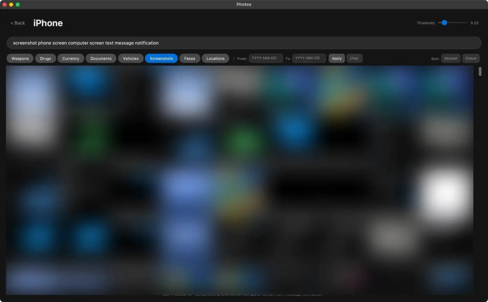

Privately extract images from encrypted iOS backups and search them with natural language using CLIP.


## Prerequisites

- **Python 3.10+**
- An **iOS backup** (iTunes/Finder format, iOS 10+)
- The backup **password** if the backup is encrypted

## Install

```bash
pip install -r requirements.txt
```

### Dependencies

| Package | Purpose |
|---------|---------|
| `torch` | Deep learning framework |
| `open-clip-torch` | CLIP model for semantic image search |
| `faiss-cpu` | Similarity search over embeddings |
| `cryptography` | AES decryption of encrypted backups |
| `customtkinter` | GUI framework |
| `Pillow` / `pillow-heif` | Image processing and HEIC support |
| `nska_deserialize` | NSKeyedArchiver deserialization |
| `numpy` | Numerical arrays |

## Usage

```bash
# Extract images from an iOS backup
python -m src extract --backup-path /path/to/backup

# Build the CLIP search index
python -m src index --output output_images/Device_Name

# Search extracted images
python -m src search "sunset at the beach" --output output_images/Device_Name

# Launch the GUI
python -m src gui
```

## Commands

| Command   | Description                          |
|-----------|--------------------------------------|
| `extract` | Extract images from iOS backup       |
| `index`   | Build/rebuild the CLIP search index  |
| `search`  | Search images by text query          |
| `gui`     | Launch the photo gallery UI          |

## GUI

The GUI is a extraction manager/photo gallery for browsing and searching extracted images.



### Search

Type a natural language query (e.g. "dog on a couch") into the search bar. Use the **threshold slider** (0.15–0.40) in the header to control how strict matching is (lower values return more results).

### Presets

Eight built-in preset categories for quick filtering: Weapons, Drugs, Currency, Documents, Vehicles, Screenshots, Faces, and Locations.

### Date filtering

Enter start/end dates (YYYY-MM-DD) to narrow results to a time range. Works in combination with search queries and presets.

### Sorting

Toggle **Newest** or **Oldest** to sort photos by date taken. Click the active sort button again to return to default order.

### Preview

Click any thumbnail to open a full preview. The **info button** toggles a metadata sidebar showing general info, location coordinates, and camera details (device, lens, ISO, aperture, focal length, shutter speed, flash, metering mode, white balance).

## Project structure

```
src/
├── __main__.py     # Entry point, sets environment variables
├── cli.py          # CLI argument parsing and subcommand dispatch
├── gui.py          # Photo gallery GUI (selector view + gallery view)
├── ios_backup.py   # Backup decryption and image extraction
├── metadata.py     # Metadata extraction from Photos.sqlite and EXIF
└── semantic.py     # CLIP embedding, FAISS indexing, and search
```
